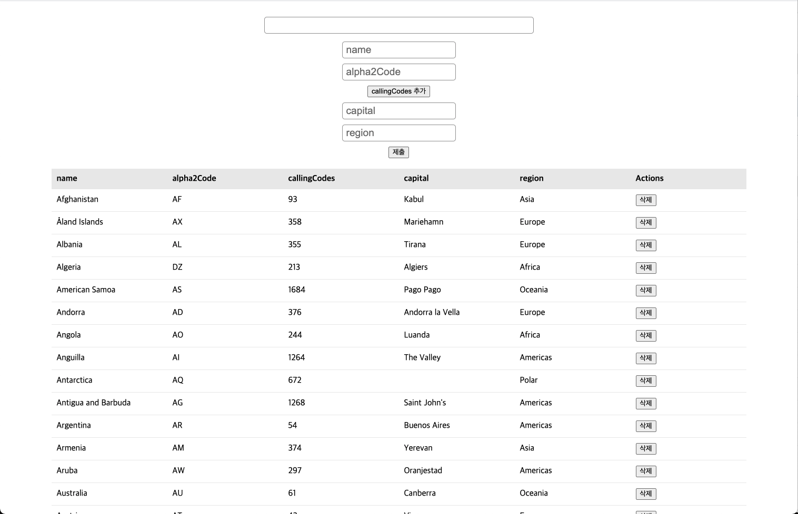

# 채널코퍼레이션 채용 과제 - 나라 정보 리스트 앱



## Quick Start

### 1. depenencies를 설치 합니다

```
$ npm install
```

### 2. 실행합니다

```
$ npm run start
```

## 주요 기능

### 0) Browser Support

모던 브라우저: Chrome, Safari, Opera, Edge, Firefox

IE 지원 여부: X

### 1) 스크롤을 통한 부분 로딩

초기에 모든 데이터를 렌더링 하지 않고, 스크롤이 화면 하단에 위치할 때 추가적인 데이터를 렌더링합니다.

### 2) 정렬

테이블의 헤더를 클릭해서 필드 별로 정렬을 수행할 수 있습니다. 정렬 기준은 다음 같이 3가지 입니다.

1. 기본: 데이터를 서버에서 불러온 순서대로 정렬
2. 오름차순
3. 내림차순

각 필드를 클릭할 때마다 기본 -> 오름차순 -> 내림차순 -> 기본 -> ... 순서대로 정렬을 수행합니다.

`callingCodes` 필드는 다른 필드와 다르게 배열로 구성되어 있기 때문에, 배열의 길이를 기준으로 정렬을 수행합니다.

### 3) 검색 기능(debounce)

검색창을 통해 데이터를 검색할 수 있습니다. 데이터의 모든 필드를 검사하며, 검색 규칙은 다음과 같습니다.

1. 부분 일치: 일부 문자열 일치를 찾습니다.
2. 대소문자 구분 X
3. 빈 문자열은 검색 안함

검색창은 0.5초간 추가 입력이 없을 경우 검색을 수행합니다. 검색한 상태에서 정렬과 스크롤이 가능합니다.

### 4) 삭제 기능

삭제 버튼을 클릭해 데이터를 삭제할 수 있습니다.

### 5) 추가 기능(redux-form 이용)

데이터를 추가할 수 있습니다. 데이터는 첫 행에 추가됩니다. `callingCodes` 필드는 문자열의 배열로 구성되어 있기 때문에 'callingCodes 추가' 버튼을 클릭하여 0개 이상의 값을 추가할 수 있습니다.
